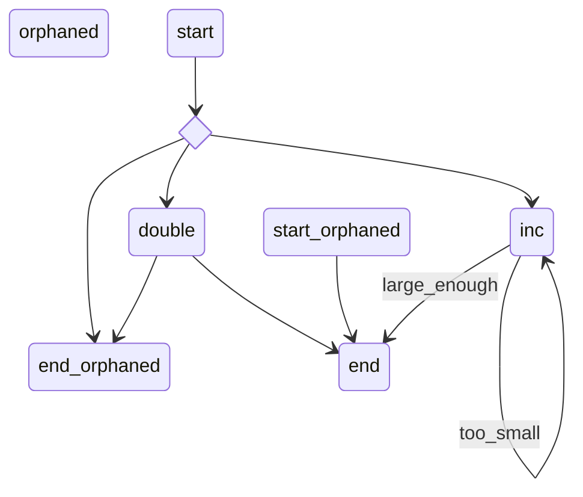

```mermaid
stateDiagram-v2
    state "inc" as inc
    state "double" as double
    state "end_orphaned" as end_orphaned
    state "orphaned" as orphaned
    state "start_orphaned" as start_orphaned
    state "start" as start
    state "end" as end
    state router_start <<choice>>
    start --> router_start : 
    router_start --> inc : 
    router_start --> double : 
    router_start --> end_orphaned : 
    double --> end_orphaned : 
    double --> end : 
    start_orphaned --> end : 
    inc --> inc : too_small
    inc --> end : large_enough

```