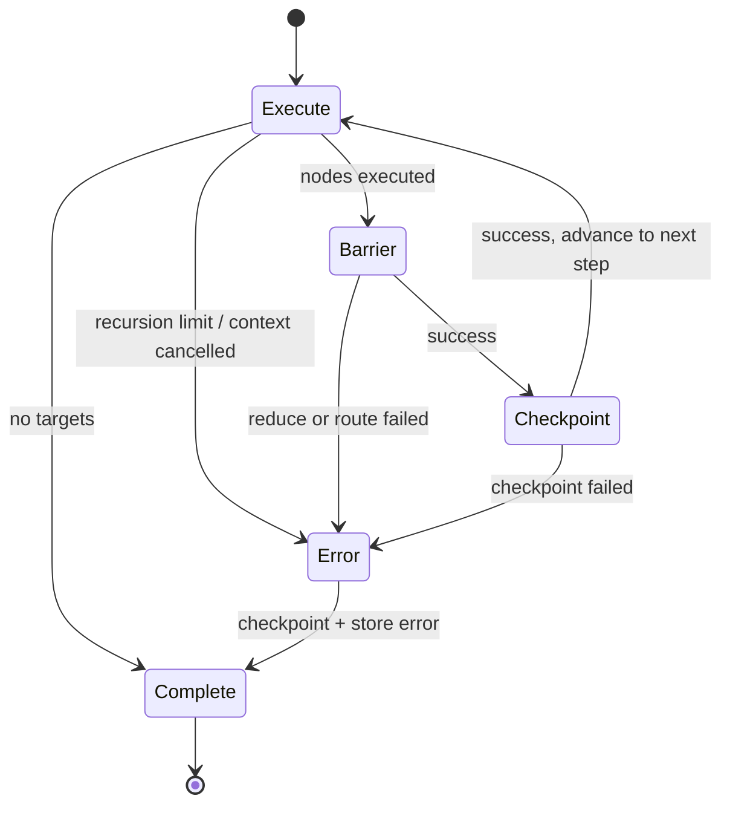

# Invoke FSM Graph

The `Invoke` function in `StateGraph` orchestrates execution via a finite state machine with four states. This diagram illustrates the state transitions and control flow.

## State Diagram



## State Descriptions

### Execute State

- **Entry:** Initial state or loop-back from Checkpoint
- **Guards:**
  - If no targets remain → terminate with success
  - If recursion limit exceeded or context cancelled → transition to Error
- **Action:** Execute all nodes in the current step concurrently
- **Exit:**
  - On guard failure → Error State
  - On success → Barrier State

### Barrier State

- **Entry:** After nodes execute successfully
- **Action:**
  - Reduce: Merge node results into graph state
  - Route: Determine next nodes based on edges and routing logic
- **Exit:**
  - On error (reduce/route fails) → Error State
  - On success → Checkpoint State

### Checkpoint State

- **Entry:** After barrier completes
- **Action:** Persist the current step to the checkpointer (for resumption)
- **Exit:**
  - On error (checkpoint fails) → Error State
  - On success → Execute State (loop back with new targets)

### Error State

- **Entry:** On error from any other state (error is captured in struct field)
- **Action:**
  - Checkpoint the last known step
  - If error supports `WithCpError`, attach checkpoint error
  - Store error in `invokeCtx.err` for retrieval
- **Exit:** Terminates FSM (returns nil, stopping execution)

## Execution Flow

**Happy path:**

```
Execute (guard pass)
↓
Barrier (success)
↓
Checkpoint (success)
↓
Execute (guard pass, new targets)
↓
... [loop until no targets or error]
↓
Execute (no targets)
↓
Complete

```

**Error path (any state):**

```

Execute/Barrier/Checkpoint (error)
↓
Error State (checkpoint + store error)
↓
Complete (FSM terminated)

```

After the FSM exits, `Invoke`:

- Checks `invokeCtx.err` — if non-nil, returns it
- Otherwise, does a final checkpoint and returns any checkpoint error

## Context Threading

All FSM states receive `invokeCtx[T]`, containing:

- `graph`, `config`, `checkpointer`, `threadId` — immutable
- `currentStep`, `steps` — mutable, updated as execution progresses
- `err` — set only by Error State, read by Invoke after FSM exits

## See Also

- `graph/graph.go:Invoke` — the driver
- `graph/invoke_fsm.go` — state implementations
- `fsm/machine.go` — FSM runner

```

```
